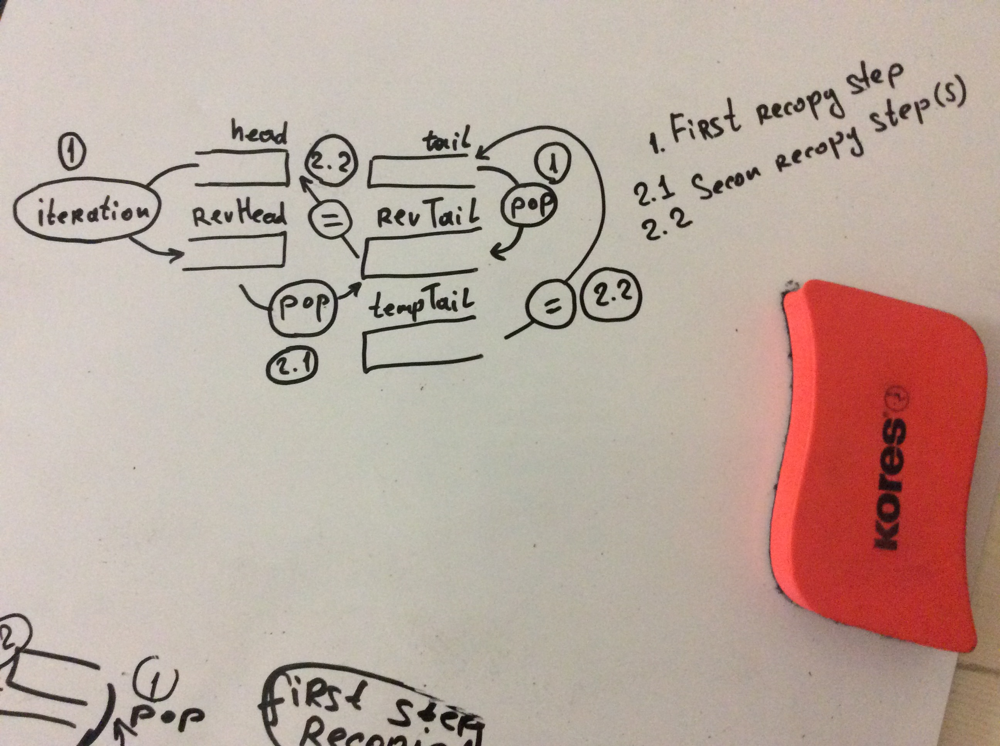

# Algorithms
Solutions to the exercises of the Algorithms book by Robert Sedgewick and Kevin Wayne (4th editon).

Just sharing my work on the exercises so far.

Work in progress, updated when new exercise done.

### Videos:

